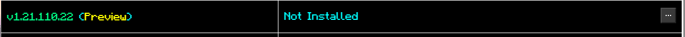
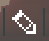
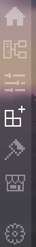

# 8Crafter's Ore UI Customizer App

The app version of [8Crafter's Ore UI Customizer](https://www.8crafter.com/utilities/ore-ui-customizer).

This app is still in beta, so please report any issues to you find [here](https://github.com/8Crafter-Studios/Ore-UI-Customizer-App/issues).

## Prerequisites

To use the app, you must be using a custom launcher, for example [Bedrock Launcher](https://bedrocklauncher.github.io). All custom launchers are supported, but if you are using a launcher other than the Windows or Linux bedrock launchers, then you must set where the app should look for the Minecraft versions in preferences, instructions for this will be on the installations tab if the app is unable to find any Minecraft versions.

## Overview

This app supports Windows, Linux, and macOS (Darwin).

### Basic usage

1. Open the app.
2. Click the installations button on the sidebar.

    

3. Find your current Minecraft version in the list.

    

4. Click the options button:

    

5. Click the install button:

    

6. Wait for the progress bar popup window to close.

### Configs

Configs allow you to change the settings of the customizer installation.

#### Importing Configs

If you are on windows and the config has a file extension of `.ouicconfig` or `.mcouicconfig`, just double click on the file (custom file type associations are currently only functional on Windows, they will be added for Linux and macOS in the future).

Otherwise, go to `File > Import > Config` in the menu bar or select the `Import Config` button on the configs tab.

#### Exporting Configs

The ability to export configs has not been implemented yet.

#### Duplicating Configs

To duplicate a config, you just select the config in the configs tab and click on the duplicate button.

#### Editing Configs

To edit a config, you just select the config in the configs tab and click on the edit button.

Then you choose your settings in the menu.

When you are done just click on the save button.

To close the menu just click on the configs tab in the sidebar again.

### Plugins

This section will be filled in soon!

### Themes

Themes are a planned feature, but have not been implemented yet.

### Marketplace

The marketplace is currently under construction.

### Sidebar

This is the sidebar, it allows you to navigate between the different pages of the app.

The home page.

The installations page.

The configs page.

The plugins page.

The themes page.

The marketplace page.

The preferences page.

## Screenshots

This is the home page of the app.

This is the installations page of the app.

This is the configs page of the app.

